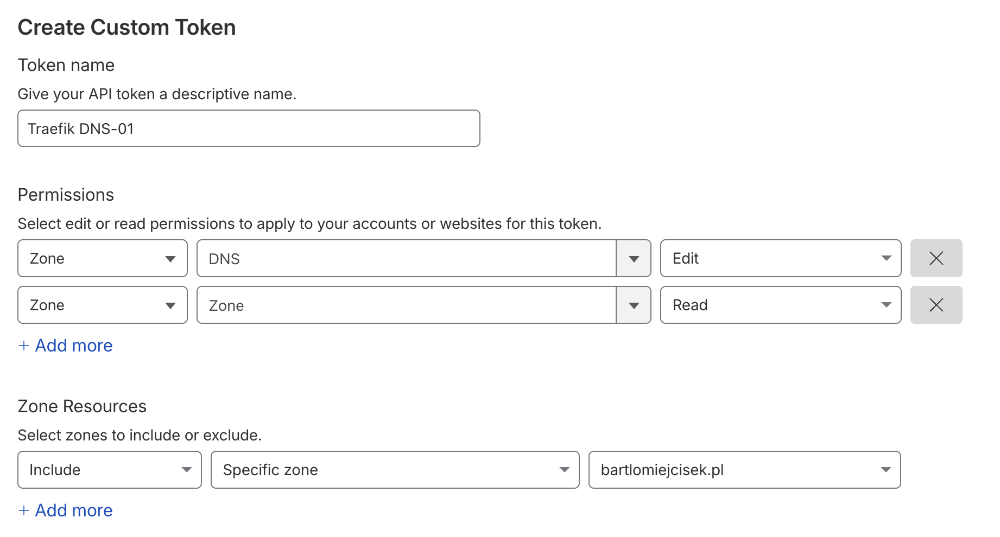

## Cloudflare API Token

To obtain the `CF_DNS_API_TOKEN` for `dns-01` challenge:

1. Go to [Cloudflare API Tokens](https://dash.cloudflare.com/profile/api-tokens).
2. Click **Create Token**.
3. Then click **Create Custom Token**.

_example:_


4. Click **Continue to summary**.
5. Copy the token and paste it into your `.env` file as `CF_DNS_API_TOKEN`.

## Configure Traefik Service Labels

```yml
labels:
  - traefik.enable=true
  - traefik.http.routers.example-app.rule=Host(`test.online`)
  - traefik.http.routers.example-app.entrypoints=web
  - traefik.http.routers.example-app.tls=true
  - traefik.http.routers.example-app.tls.certresolver=cloudflare
networks:
  - traefik
```

## Adjust Traefik Configuration

Before starting, remember to adjust `traefik.yml` to your needs:

1.  **Email**: Update the `email` field under `certificatesResolvers.cloudflare.acme` to your Cloudflare account email.
    ```yaml
    email: "your-email@example.com"
    ```
2.  **Dashboard Domain**: Update the `Host` rule for the dashboard router to match your desired domain (e.g., `traefik.yourdomain.com`).
    ```yaml
    rule: "Host(`traefik.yourdomain.com`) ..."
    ```
3.  **Basic Auth**: Update the `users` list under `http.middlewares.auth.basicAuth` with your own secure credentials. You can generate a htpasswd using an online tool or command line (e.g., `htpasswd -nb admin secure_password`).
    ```yaml
    - "admin:$apr1$..."
    ```
